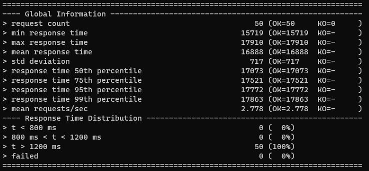
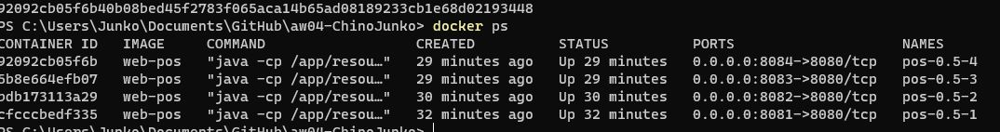
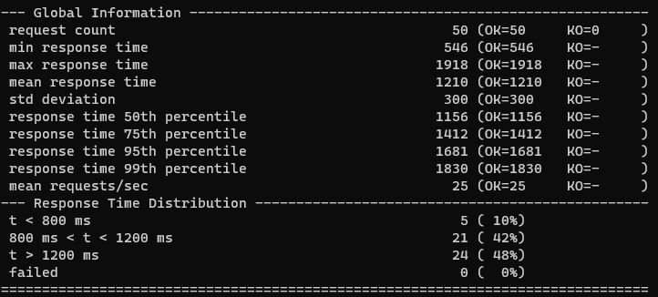
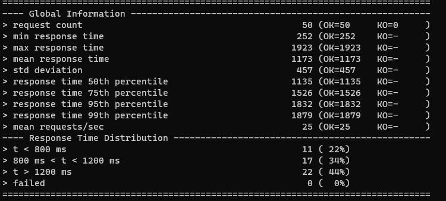
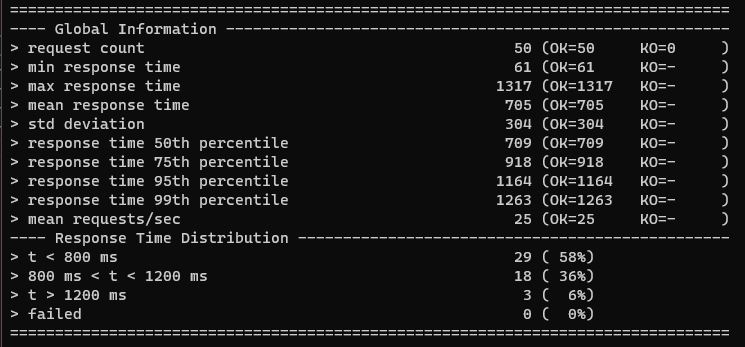
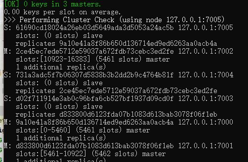
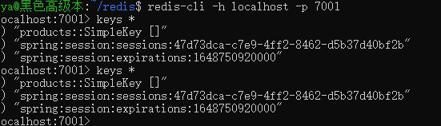
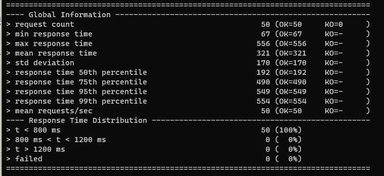

# Report
## Task1
### Build a Docker Image

在docker中以0.5核运行（端口映射为8081）：
```
 docker run -d --name pos-0.5 --cpus=0.5 -p 8081:8080 web-pos
```
### Load Test
模拟50用户请求根目录
```
ScenarioBuilder scn =
      scenario("Pos")
          .exec(http("request").get("/"));
  {
    setUp(scn.injectOpen(atOnceUsers(50)).protocols(httpProtocol));
  }
```
得到报告如下：

从报告可看出，服务器先花费15秒左右的时间从京东抓取数据，随后才开始响应请求渲染界面

---

## Task2
### Horizontally Scalable
在docker中创建4个容器运行web

然后在WSL中配置Haproxy并运行，配置文件如下：
```
defaults
	mode	tcp

frontend https_frontend
        bind *:8080
        default_backend dynamic_servers

backend dynamic_servers
        balance roundrobin
        server server1 localhost:8081
        server server2 localhost:8082
		server server3 localhost:8083
		server server4 localhost:8084
```
### Load Test
首先让haproxy仅连接一个服务器，测得结果如下：

然后连接两个服务器进行轮询，测得结果如下：

可以看出差距较小，那么接下来连接4个服务器进行轮询，测得结果如下：

得到结果是从一台服务器到4台服务器的水平扩展令响应时间缩短至一半左右。

---

## Task3
### Cache and Session
#### Cache
为了缓存，在调用获取商品函数处加入**Cacheable**标识符来将需要耗费时间获取的商品信息进行缓存。
然后在入口函数处加入**EnableCaching**标识符来提示Springboot配置相应组件。

#### Session
在入口函数处使用**EnableRedisHttpSession**配置相应组件，在控制器中保存一个Session成员，并将Cart存入Session中，这样就能在访问相同对话时直接获得上次的购物单信息。

### Redis Cluster
首先配置6个Redis Node,并将其组成网络，其中有3个Master结点和3个Slave结点:

在application.properties中设置3个Master结点的地址，并在Pom文件中加入相应依赖，Springboot就会自动将服务器与Redis集群连接。

在访问网页后，查看其中一处结点的keys，可看到其中已经储存有session信息：

### Load Test
对单个服务器进行负载测试：

对比前面结果可得出加入Cache的服务器性能更优秀了。