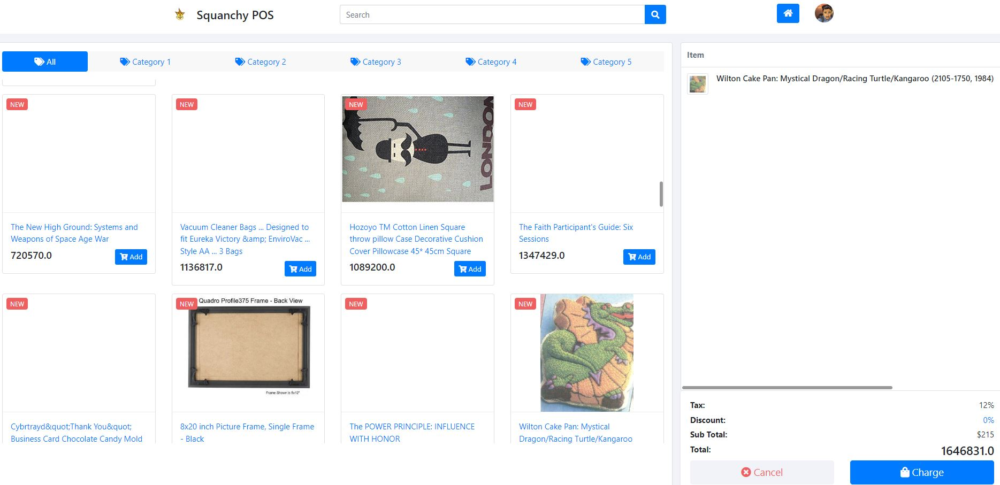

# AmazonPOS

# 结构
    AmazonData #亚马逊元数据（已忽略）
    |-meta_Books
    |-meta_Gift_Cards
    |-meta_Home_and_Kitchen
    L-meta_Magazine_Subscriptions
    AmazonDB #读取数据到MySQL
    |
    L...-resources
            Lapplication.properties #MySql配置
    AmazonPos #Pos网站
    |
    L...-resources
            Lapplication.properties #Redis配置MySql配置
# 环境
## MySQL: 8.0.26
## redis: 5.0.7
## WSL: 10.0.19041
# 数据量
## Table rows: 3040908
## Data length: 1.1GB
# 网站
## 使用了Cache, 并且为了效率将根据Session随机分配100个商品到网页，若想要重新随机商品删除session即可。

